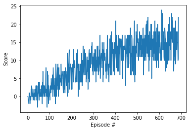

# Project report

## Learning algorithm

### Deep Q-Learning

The Deep Q Learning (DQN) algorithm was used as described in the following paper: [Human-level control through deep reinforcement learning](https://www.nature.com/articles/nature14236)

### Model architecture

The DQN algorithm used relied on a different neural network architecture than described in the paper above:
1. Fully connected layer with input 37 (Unity's provided environment state vector) to output 64 units with ReLU activation
1. Fully connected layer with input 64 units to output 64 units with with ReLU activation
1. Fully connected layer with input 64 units to output 4 (Unity's provided action space size)

### Hyperparameters

The following notable parameters were used in the DQN algorithm:
* Maximum training episodes = 3000
* Maximum number of timesteps per episode = 1000
* Starting epsilon for epsilon-greedy action selection = 1.0 
* Ending epsilon = 0.01
* epsilon decay rate = 0.995
* Discount factor (gamma) for future rewards = 0.99  
* Learning rate = 5e-4 

## Rewards per episode

The goal was to train an agent to achieve an average score of 15 or greater during 100 episodes. Training time is described below. The agent was trained in just 689 episodes. Refer to `./checkpoint.pth` for the weights used on Cuda architecture.

```
Episode 100	Average Score: 1.10
Episode 200	Average Score: 4.54
Episode 300	Average Score: 7.94
Episode 400	Average Score: 10.18
Episode 500	Average Score: 12.50
Episode 600	Average Score: 14.56
Episode 689	Average Score: 15.04
Environment solved in 689 episodes!	Average Score: 15.04
```

## Improving the agent's performance
Some options beyond further hyperparameter tuning and longer training time would include changing the model architecture to try out the following novel approaches:
* Double DQN
* Dueling DQN
* Implementing the Rainbow algorithm
* Prioritized experience replay